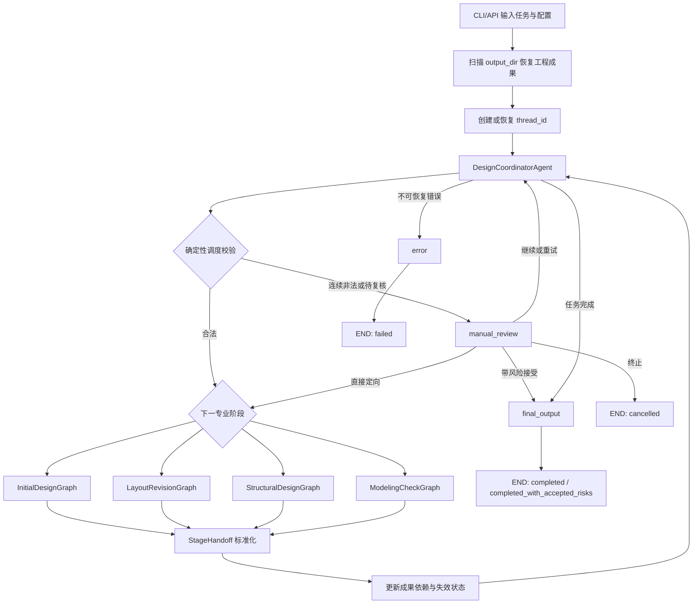
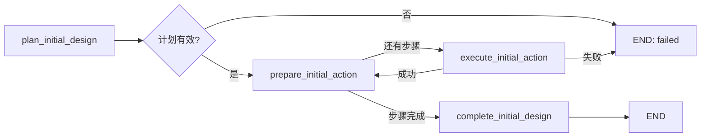
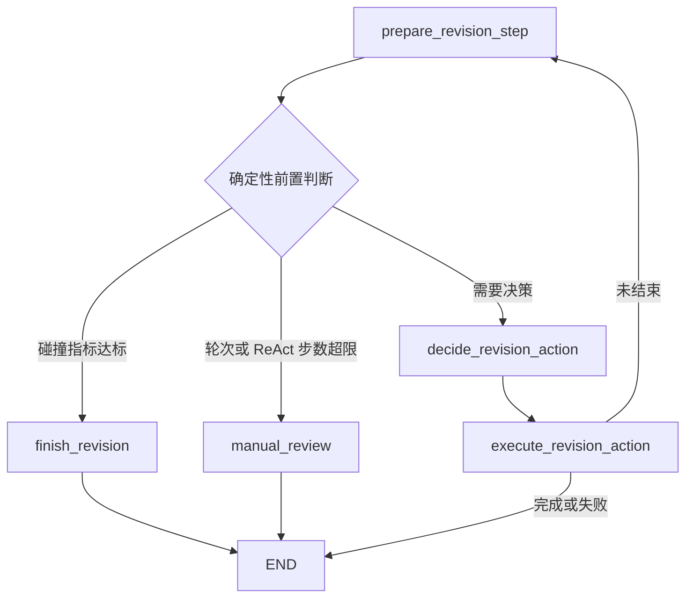
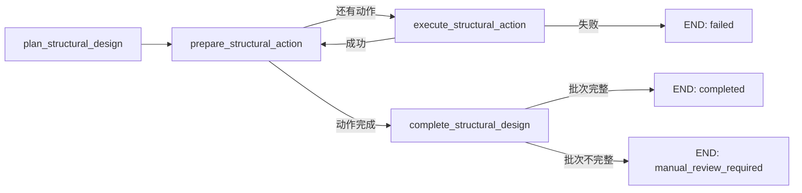
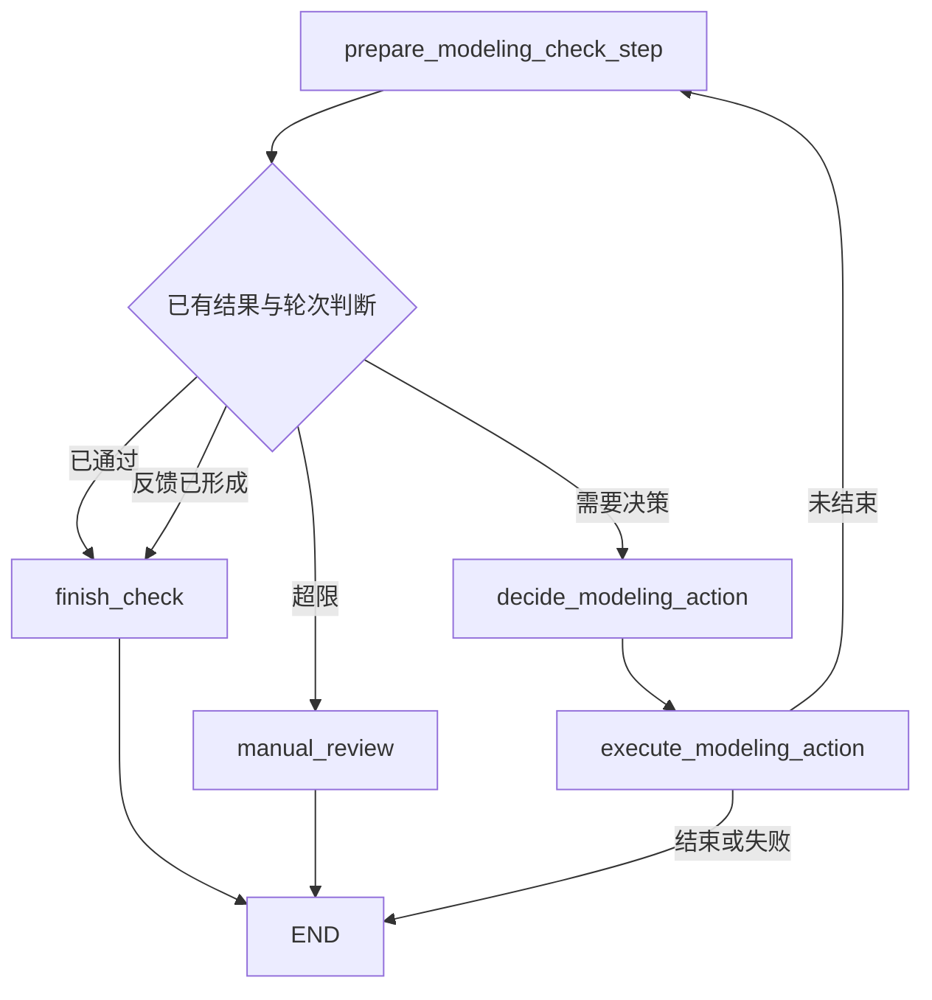
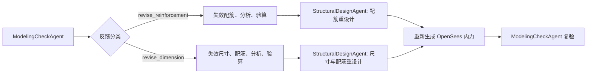
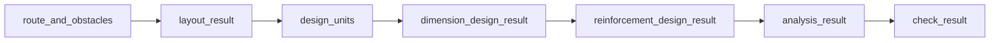
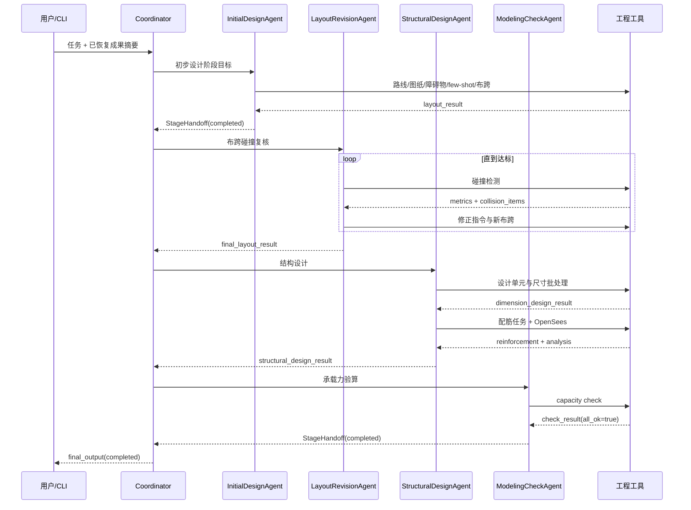

# 高速公路桥梁智能设计多智能体系统运行机制详解

更新时间：2026-08-24

本文说明系统当前代码如何实际运转，主线为 `run_multi_agent.py --graph-v2`。内容覆盖输入恢复、总体协调、四个专业 Agent 子图、Action 执行、成果交接、返修、人机协同、断点恢复和最终输出。旧兼容图和规范 RAG 的当前状态单独说明。

## 1. 方法的基本控制思想

系统采用层级多智能体与确定性工程工具结合的运行方式。不同主体承担不同控制责任：

| 主体 | 负责内容 | 不能直接决定的内容 |
| --- | --- | --- |
| DesignCoordinatorAgent | 理解任务、提出下一专业阶段、说明阶段目标 | 绕过前置成果、跳过强制验算、修改确定性校验结果 |
| 专业 Agent | 在本专业允许的动作集合内规划或选择下一动作 | 直接控制顶层阶段跳转 |
| Action runner | 检查输入、执行工具、包装异常、记录输出字段 | 生成跨阶段调度策略 |
| 工程工具 | 路线处理、图纸处理、碰撞检测、OpenSees 分析和承载力验算 | 自由扩展任务范围 |
| 确定性规则层 | 调度合法性、成果依赖、批次完整性、轮次和状态门控 | 代替 LLM 生成设计候选 |
| 人工复核 | 对未收敛、部分失败和带风险结果作流程决定 | 改写原始碰撞指标或验算数值 |

系统允许 LLM 提出候选决策，但只有通过动作权限、输入条件、成果依赖和调度规则后才会执行。

## 2. 总体运行图



一次专业阶段结束后必定回到协调器。协调器读取最新成果和 `StageHandoff`，重新判断下一阶段、返修阶段、人工复核或结束。

## 3. 从命令启动到进入图

### 3.1 CLI 参数解析

`run_multi_agent.py` 接收：

```text
user_request              自然语言任务；缺省时读取配置
--config                  配置文件
--graph-v2                启用显式协调图
--interactive             在终端处理人工复核 interrupt
--thread-id               新任务的持久化线程标识
--resume                  恢复已有线程
--decision                恢复时提交人工动作
--feedback                人工补充要求
--extra-rounds            增加的自动修正轮数
--initial-state-json      开发调试用额外初始状态
```

普通运行只要求原始资料路径、输入图纸、输出目录和线路前缀。中间成果路径不作为普通配置入口。

### 3.2 工程成果恢复

`bridge_agents.agent._discover_existing_outputs(output_dir)` 在建图前扫描已有目录，恢复：

```text
路线平面 JSON、掩码、PGW、障碍物 JSON
初始或最终布跨结果、最新修正轮次和碰撞指标
设计单元、尺寸设计、配筋设计和结构汇总
配筋 YAML、OpenSees 内力文件和承载力验算结果
```

恢复后的结果写入 `AgentState`。因此，重新启动一个任务时，专业 Agent 可以看到已有成果并规划缺失步骤。

### 3.3 checkpoint 恢复

Graph V2 使用：

```text
output_dir/checkpoints/graph_v2.sqlite
```

并以 `thread_id` 区分运行线程。两种恢复机制用途不同：

| 机制 | 保存内容 | 可恢复粒度 |
| --- | --- | --- |
| `output_dir` 成果扫描 | 工程 JSON、YAML、图像和分析文件 | 已完成的工程环节 |
| LangGraph checkpoint | 当前节点、共享状态、interrupt 和线程上下文 | 精确的图执行位置 |

`--resume THREAD_ID --decision ...` 会通过 LangGraph `Command(resume=...)` 恢复。只有 Graph V2 支持图断点恢复。

### 3.4 初始状态建立

系统将配置、发现的成果、用户任务和从任务文本解析出的起终桩号合并为 `AgentState`。新任务生成 UUID 或使用指定 `thread_id`，然后进入 `design_coordinator`。

## 4. DesignCoordinatorAgent 如何调度

### 4.1 只读协调视图

协调器不会直接接收所有原始工程文件。`build_coordinator_view()` 抽取以下控制信息：

```text
各阶段成果是否存在且有效
承载力验算是否通过
批处理是否完整或已经人工接受
当前布跨和结构返修轮次
是否存在人工复核项
revision_target 和 invalidated_artifacts
最新 StageHandoff
```

被列入 `invalidated_artifacts` 的成果，即使状态中仍存在对象，也按不可用处理。

### 4.2 LLM 调度输出

协调器输出结构化 `CoordinatorDecision`：

```text
intent
next_stage
stage_objective
reason
revision_target
required_artifacts
task_complete
```

首次决策用于识别流程入口。后续决策读取最新 Handoff，判断继续顺序、局部返工或结束。

### 4.3 确定性调度校验

每个 LLM 决策必须满足：

1. `next_stage` 已在顶层图注册；
2. 目标阶段的前置成果有效；
3. 已完成阶段只有在存在明确返修目标时才能重复调度；
4. 需要验算的任务不能跳过 ModelingCheckAgent；
5. 验算失败结果不能自动放行；
6. 决策中的返修目标必须与 `RevisionRequest` 一致；
7. 修正轮次未达到上限；
8. 未解决人工复核项存在时不能自动结束。

非法决策会携带校验错误重新请求。连续非法、输出无法解析或需要人工判断时进入 `manual_review`。

### 4.4 顶层节点路由

合法决策只能进入：

```text
initial_design
layout_revision
structural_design
modeling_check
manual_review
final_output
error
```

四个专业节点执行完毕后都通过固定边返回 `design_coordinator`。

## 5. Action 层如何工作

每个可执行工具都登记为 `ActionSpec`：

```text
name                 稳定动作名
func                 实际 Python 函数
required_keys        必须存在的状态字段
required_any         至少存在一个的字段组
expected_key         主要预期成果
produced_keys        声明的输出字段
```

Action runner 的执行顺序为：

```text
读取 ActionSpec
  -> 检查 required_keys / required_any
  -> 调用工具函数
  -> 捕获异常和非字典返回
  -> 生成 ActionResult
  -> 将 update 合并回子图状态
  -> 写入 agent_events 和阶段历史
```

Agent 只能执行 `AGENT_ACTIONS` 分配给自己的动作，LLM 输出其他动作时会失败或由规则兜底。

## 6. InitialDesignAgent：初步设计子图

### 6.1 子图结构



### 6.2 阶段规划

规划器向 LLM 提供已有成果布尔摘要、允许步骤和输出 Schema。LLM 只能从以下步骤生成 `required_steps`：

```text
load_data
drawing_crop_and_mask
obstacle_semantic_extractor
select_samples
generate_layout_design
```

已有成果可以写入 `skipped_steps`。`required_steps` 出现未注册动作、格式错误或 `can_execute=false` 时，本阶段失败。

### 6.3 五个动作的实际职责

| Action | 关键输入 | 主要运行内容 | 关键输出 |
| --- | --- | --- | --- |
| `load_data` | 路线目录、前缀、起终桩号 | 读取并裁剪纬地路线数据，生成平面数据 | `cropped_data`、`plane_json_path` |
| `drawing_crop_and_mask` | 平面 JSON、图纸 | 转换和裁剪图纸，生成栅格图、PGW 和障碍物掩码 | `mask_path`、`pgw_path` |
| `obstacle_semantic_extractor` | 掩码、PGW | 将像素语义转换成带工程坐标的障碍物记录 | `obstacle_json_path`、可视化 |
| `select_samples` | few-shot 库 | 构造当前 K/Z 线地形特征表并选择相似样例 | `few_shots`、`design_input` |
| `generate_layout_design` | 当前设计输入或路线成果 | 渲染 Prompt、调用模型、解析布跨结果 | `layout_result` |

当前线路输入与 few-shot 设计线、地面线统一压缩成 K/Z 线地形特征表。样例选择使用有效性掩码排除缺失点，减少无效 token。

### 6.4 阶段退出

所有计划动作成功后写入 `initial_design_completed`。InitialDesignAgent 当前不原生生成 Handoff，Graph V2 的 `make_stage_node()` 会把阶段输出标准化为 `StageHandoff`，随后返回协调器。

## 7. LayoutRevisionAgent：布跨修正 ReAct 子图

### 7.1 子图结构



### 7.2 ReAct 状态循环

每一轮保存：

```text
thought
action
observation
react_step
```

最新 observation 会进入下一轮可见状态。LLM 调用或 JSON 解析失败时使用规则动作选择器。

### 7.3 可用动作及顺序

```text
run_collision_detection
  -> generate_revision_instruction
  -> build_revision_prompt
  -> generate_revised_layout
  -> run_collision_detection
```

| Action | 运转内容 |
| --- | --- |
| `run_collision_detection` | 根据路线平面、掩码、PGW 和当前布跨计算碰撞项及统计指标 |
| `generate_revision_instruction` | 将碰撞项整理成受工程约束的修正要求 |
| `build_revision_prompt` | 合并当前布跨、修正要求和压缩地形输入 |
| `generate_revised_layout` | 调用模型生成新布跨，并递增修正轮次 |
| `finish_revision` | 固化当前布跨为最终修正结果 |
| `manual_review` | 标记需要人工复核并退出专业子图 |

### 7.4 碰撞修正约束

当前规则包括：

- 分离式左右幅按 `(bridge_id, side_label)` 分开聚类；
- 只有碰撞点、缺少明确障碍区间时，不由多个墩位纵向包络推导异常大跨；
- 普通墩碰撞优先在 20/25/30/35/40 m 标准跨中重新平衡；
- 桥台碰撞优先调整边界；
- 多墩聚集或信息不足进入人工复核；
- 修正过程不能凭碰撞反馈新增缺乏体系依据的特殊大跨。

### 7.5 退出条件

```text
碰撞指标通过       -> completed，建议进入结构设计
修正轮次达到上限   -> manual_review
ReAct 步数达到上限 -> manual_review
Action 执行错误     -> failed
```

该 Agent 原生生成 `StageHandoff`。

## 8. StructuralDesignAgent：结构设计子图

### 8.1 子图结构



### 8.2 阶段规划

LLM 根据以下信息生成 `required_steps`：

```text
布跨结果、设计单元、尺寸、配筋、结构汇总是否存在
revision_context
feedback_decision
用户任务意图
```

允许步骤为：

```text
extract_design_units
dimension_design
reinforcement_design
summarize_structural_design_result
```

来自 ModelingCheckAgent 的返修会强制重新规划，避免复用上一轮完整设计计划。

### 8.3 设计单元提取

`extract_design_units` 将布跨结果转换成可独立设计的桥梁分联和墩组，主要门控包括：

- 30 m 及以下标准跨单元原则上不超过 120 m；
- 40 m 跨单元原则上不超过 200 m；
- 相邻单元尽量均衡；
- 变宽边界和结构体系变化处允许分界；
- 墩位角色限制为桥台、边墩和中间墩；
- 校验墩号、跨数、跨径、单元长度、连接关系和左右幅编号；
- 首次语义校验失败时允许一次带错误信息的修复调用；再次失败后阻断下游设计。

历史“过渡墩”只在恢复旧成果时兼容映射为“边墩”，并记录警告。

### 8.4 尺寸设计批处理

```text
设计单元展开
  -> 按墩组构造任务
  -> 样本角色和体系归一化
  -> 同角色同体系匹配
  -> 同角色跨体系兜底匹配
  -> 有界线程池并行调用
  -> 按原任务顺序稳定合并
  -> 形成 dimension_batch_status
```

默认 `dimension_max_workers=4`。有效样本为空时，该任务直接失败并给出诊断，不会向模型发送空示例 Prompt。

### 8.5 配筋设计批处理

```text
尺寸结果展开为墩组任务
  -> 串行执行 OpenSees 确定性预处理
  -> 保存每个任务的预处理上下文
  -> 取得内力和控制信息
  -> 有界并行调用配筋模型
  -> 必要时进行有限次格式修复
  -> 按原任务顺序稳定合并
  -> 形成 reinforcement_batch_status
```

默认 `reinforcement_max_workers=3`、`reinforcement_max_format_repairs=1`。OpenSees 预处理保持串行，避免共享文件和求解器上下文互相干扰；模型生成部分并行。

### 8.6 批次完整性门控

尺寸或配筋任务失败时保存失败任务 ID、成功数、失败数和 `stage_complete=false`。结构汇总可以形成，但顶层进入结构设计人工复核：

```text
retry_failed_tasks           只重试失败或缺失任务
accept_partial_and_continue  保留部分成果并记录风险
abort                        中止
```

### 8.7 阶段退出

结构汇总包含设计单元、尺寸、配筋、批次状态和传给验算阶段的就绪标志。StructuralDesignAgent 当前由 Graph V2 顶层包装器生成标准 Handoff。

## 9. ModelingCheckAgent：承载力验算与反馈 ReAct 子图

### 9.1 子图结构



### 9.2 ReAct 动作顺序

```text
run_capacity_check
  -> generate_revision_instruction
  -> finish_check
```

其中 `generate_revision_instruction` 在 Action registry 中实际映射到 `generate_modeling_feedback`。

### 9.3 承载力验算

`run_capacity_check` 从配筋详细结果中提取全部成功分组，并按 `task_id` 一一配对配筋 YAML 与 OpenSees 内力包络。每个分组写入独立的 `capacity_check/<task_id>/` 目录并串行调用确定性验算工具；串行策略用于隔离验算脚本的模块全局变量和绘图上下文。批次完成后生成：

```text
overall_check
control_sections
utilization_summary
capacity_check_summary_path
capacity_check_results
capacity_batch_status
包络和利用率可视化文件
```

批次聚合结果保存在 `capacity_check/capacity_check_batch_summary.json`。`overall_check.all_ok` 仅在所有已调度分组均执行成功且工程验算全部通过时为真；控制截面使用 `task_id::control_name` 命名，最大利用率同时记录来源任务。多路径集合无法配对、任务编号重复或任一任务缺少输入时会在调用验算工具前返回明确错误，不生成伪造结果。旧的单路径输入仍保留兼容。

协调器只有在批次 `stage_complete=true` 时才把建模验算视为已完成。部分分组已经产生结果但仍有执行失败时，流程保留在建模验算阶段，不允许跳过缺失任务进入最终输出。重新启动时优先恢复批量汇总文件，避免把某个子目录的单项汇总误识别为全桥结论。

### 9.4 反馈分类

反馈决策只允许：

```text
pass
revise_reinforcement
revise_dimension
```

LLM 读取整体结论、控制截面和利用率摘要后给出候选分类。输出解析失败或越界时采用确定性兜底：

```text
最大利用率 <= 1.20 且有明确失败项 -> revise_reinforcement
其余未通过情况                   -> revise_dimension
```

修正决策生成 `feedback_decision` 和 `revision_context`，记录目标步骤、控制原因、控制截面、利用率和重新验算要求。

### 9.5 返回结构设计



ModelingCheckAgent 生成原生 `StageHandoff`，其中：

```text
target_stage = structural_design
required_artifacts = [reinforcement_design_result]
或
required_artifacts = [dimension_design_result]
```

协调器的确定性校验会强制下一返修阶段与该请求一致。

### 9.6 复验与轮次

每次生成尺寸或配筋返修，`check_iteration_index` 增加。结构返修重新进入 ModelingCheckAgent 时，旧 `feedback_decision`、`check_result` 和 `capacity_check_result` 被清除，随后重新验算。

达到 `max_check_revision_rounds` 或最大 ReAct 步数后进入人工复核。用户可以继续返修、接受验算风险并结束，或中止。

## 10. StageHandoff 如何连接专业 Agent

标准 Handoff 包含：

```text
stage
status
produced_artifacts
findings
revision_request
invalidated_artifacts
recommended_next_stage
unresolved_code_items
message
```

状态主要包括：

```text
completed
revision_required
failed
manual_review
```

当前实现情况：

| 专业 Agent | Handoff 形成方式 |
| --- | --- |
| InitialDesignAgent | 顶层 `make_stage_node()` 根据阶段输出标准化 |
| LayoutRevisionAgent | Agent 原生生成，顶层校验后沿用 |
| StructuralDesignAgent | 顶层 `make_stage_node()` 根据阶段输出标准化 |
| ModelingCheckAgent | Agent 原生生成，顶层校验后沿用 |

专业 Agent 的 `recommended_next_stage` 只是建议。最终路由仍由协调器和确定性调度校验共同确定。

## 11. 成果依赖与最小返工

### 11.1 依赖链



### 11.2 失效传播

返修请求中的 `required_artifacts` 会连同其全部下游成果加入 `invalidated_artifacts`，相应运行字段和路径被清空。

| 发生变化的成果 | 保留 | 失效并重做 |
| --- | --- | --- |
| 路线或障碍 | 无下游成果 | 布跨及其全部下游 |
| 布跨 | 路线与障碍 | 设计单元、尺寸、配筋、分析、验算 |
| 尺寸 | 布跨和设计单元 | 配筋、分析、验算 |
| 配筋 | 布跨、设计单元和尺寸 | 分析、验算 |
| 日志或 Prompt | 全部工程成果 | 无 |

协调器构建视图时将失效成果视为不存在。阶段产生新成果后，`build_artifact_refresh_update()` 从失效集合移除已重建项；目标阶段负责的成果全部刷新后，清除 `revision_target`。

## 12. 人工复核如何运转

`manual_review` 使用 LangGraph `interrupt()` 暂停线程，并返回适合 CLI、Web UI 或 API 展示的审核请求。

### 12.1 布跨复核

| 动作 | 状态更新与路由 |
| --- | --- |
| `continue_revision` | 增加布跨修正轮数，返回 LayoutRevisionAgent |
| `accept_and_continue` | 固化当前布跨，将碰撞指标写入接受风险，返回协调器 |
| `abort` | 状态设为 `cancelled`，结束并保留成果 |

### 12.2 结构批次复核

| 动作 | 状态更新与路由 |
| --- | --- |
| `retry_failed_tasks` | 携带失败任务 ID 返回 StructuralDesignAgent |
| `accept_partial_and_continue` | 标记批次人工接受，写入 `accepted_risks`，返回协调器 |
| `abort` | 中止并保留成果 |

### 12.3 验算复核

| 动作 | 状态更新与路由 |
| --- | --- |
| `continue_modeling_revision` | 增加验算返修轮数和 ReAct 步数，继续验算返修 |
| `accept_check_and_finish` | 写入未通过验算风险，进入 final_output |
| `abort` | 中止并保留成果 |

### 12.4 协调器复核

协调器连续非法或无法决策时，可选择 `retry_coordinator` 或 `abort`。

人工接受不会修改碰撞或验算数值。布跨、结构部分成果和验算结果的接受风险均保存在 `accepted_risks`，最终状态为 `completed_with_accepted_risks`。

### 12.5 人工决定持久化与恢复

`human_review_node` 应用决定后，会把规范化决定追加保存到：

```text
output_dir/human_review/human_review_decisions.jsonl
```

每条记录包含 `decision_id`、复核类型、动作、反馈、时间、受审成果路径、成果 SHA256、接受风险和必要的批次状态。所有动作都会进入审计账本，但跨线程恢复只复用以下长期授权：

```text
accept_and_continue
accept_partial_and_continue
accept_check_and_finish
```

恢复器按复核范围读取最后一条决定，同时校验受审成果路径和 SHA256。两者均一致时恢复阶段接受标志、`accepted_risks` 和人工复核历史；路径变化、文件变化或后续出现继续修正/重试决定时，旧接受授权不再生效。SQLite checkpoint 仍负责同一线程的精确中断恢复，JSONL 账本负责跨线程、跨进程的工程决定恢复。

## 13. Prompt、Skill 和审计如何工作

### 13.1 PromptRegistry

当前有效模板由 `prompts/manifest.yaml` 注册，通过稳定 `prompt_id` 渲染。Jinja2 `StrictUndefined` 会在上下文缺失时失败，避免静默生成不完整 Prompt。

显式 `template_path` 或 `prompt_path` 的优先级高于 PromptRegistry，主要用于测试和开发覆盖；普通用户配置不暴露这些中间路径。

### 13.2 Skill 和 Action 权限

Skill 说明 Agent 的角色、决策边界和输出要求。实际动作权限以代码中的 `AgentContract/AGENT_ACTIONS` 为准，Markdown 内容不能动态授予新工具权限。

### 13.3 Prompt 审计

每个重要模型任务记录：

```text
prompt_id、version、template_sha256
stage、task_id、attempt
rendered_prompt_path
status、error
```

统一追加到：

```text
output_dir/logs/prompt_trace.jsonl
```

任务重跑使用追加式文件名，保留历史 Prompt 和响应。

## 14. RAG 在当前系统中的位置

规范四库 RAG 已完成：

```text
源 YAML -> 证据文档 -> SQLite FTS5
                    -> BGE 向量
                    -> RRF 混合检索
```

它可以独立返回 `CodeEvidenceBundle`，但尚未自动接入四个专业 Agent。当前设计主链使用 Prompt、few-shot 和确定性工程规则，不能声称已经完成规范证据门控。

后续接入后的预期位置是：

```text
专业任务形成 CodeQuery
  -> 检索少量可追溯证据
  -> 证据适用性检查
  -> 注入任务 Prompt
  -> 工程工具计算和合规检查
  -> 形成 ComplianceResult
```

## 15. 输出、日志与可追溯性

系统同时保存三类信息：

| 类型 | 典型位置 | 用途 |
| --- | --- | --- |
| 工程成果 | `output_dir/structural_design/` 等 | 后续设计、复验和成果恢复 |
| 模型审计 | `output_dir/logs/prompt_trace.jsonl` 及任务目录 | 追踪 Prompt、响应和重试 |
| 图运行状态 | `output_dir/checkpoints/graph_v2.sqlite` | 恢复线程和人工 interrupt |
| 人工决定 | `output_dir/human_review/human_review_decisions.jsonl` | 审计并恢复仍适用于当前成果的长期授权 |

`final_output` 汇总完成状态、已执行 Agent、最新 Handoff 和接受风险：

```text
无人工接受风险 -> completed
存在接受风险   -> completed_with_accepted_risks
不可恢复错误   -> failed
用户中止       -> cancelled
```

## 16. 一次完整成功案例的时序



如果验算失败，M 向 C 提交 `RevisionRequest`，C 将流程返回 S；S 只重建失效成果，再由 M 复验。

## 17. 兼容图如何运转

未传 `--graph-v2` 时运行旧兼容图：

```text
TaskAllocationAgent
  -> 生成 agent_sequence
  -> agent_executor 按索引执行专业 Agent
  -> ModelingCheckAgent 需要返修时将索引跳回 StructuralDesignAgent
  -> 后续顺序再回到 ModelingCheckAgent
  -> final_output
```

兼容图具备专业 Agent 功能和结构返修回跳，但缺少 Graph V2 的显式协调节点、统一顶层人工 interrupt 和 SQLite 图恢复。它用于历史运行兼容与对照。

## 18. 当前方法边界与后续修补点

1. Graph V2 仍需通过 `--graph-v2` 启用，默认入口尚未切换；
2. InitialDesignAgent 和 StructuralDesignAgent 的 Handoff 仍由顶层包装器标准化；
3. 初步设计和结构设计的 `required_steps` 由 LLM 规划，当前只校验格式与动作权限，缺少对最小必需步骤的完整确定性证明；
4. 验算反馈的主路径由 LLM 分类，确定性兜底主要使用 `1.20` 利用率阈值，尚未形成覆盖破坏类型、构造边界和多轮收敛历史的规则分类器；
5. 尺寸与配筋已支持有界并发；承载力验算覆盖全部成功配筋分组，但当前逐组串行执行，较大批次的运行时间仍需后续优化；
6. RAG 尚未接入专业 Agent，当前规范性结论没有形成自动证据闭环；
7. checkpoint 可以恢复图状态，但工程文件被外部修改后的 checkpoint—成果一致性仍需要加强校验；
8. 实际线路端到端测试数量仍有限，默认入口切换需要更多案例和消融对照。

## 19. 论文中的方法表达建议

可将本文机制压缩为以下四个方法模块：

1. **层级协调机制**：总体协调 Agent 根据成果状态和 Handoff 动态选择专业子图，确定性规则校验阶段路由；
2. **专业子图机制**：初步设计和结构设计采用受控规划—执行图，布跨修正和建模验算采用有限动作空间 ReAct 图；
3. **成果驱动返工机制**：通过 Artifact 依赖、失效传播和 RevisionRequest 实现尺寸或配筋层级的局部返工；
4. **人机协同与可追溯机制**：通过 interrupt、checkpoint、Prompt 审计和风险状态区分，处理自动流程无法可靠收敛的情况。

效果展示可围绕一条完整线路给出：输入资料、初始布跨、碰撞修正前后、设计单元、尺寸与配筋、OpenSees 内力、承载力利用率、一次返修闭环、人工复核界面和最终可追溯文件。方法评价应同时报告成功流程、返修流程、失败任务恢复、运行时间、模型调用次数和人工介入点。

## 20. 代码定位

```text
run_multi_agent.py                 CLI、交互复核与恢复参数
bridge_agents/agent.py             初始状态、成果扫描、兼容图入口
bridge_agents/graph_v2.py          顶层协调图和人工复核
bridge_agents/stage_agents.py      四个专业 Agent 子图
bridge_agents/actions.py           ActionSpec、ActionResult 和权限表
bridge_agents/tool_actions.py      工程 Action 实现
bridge_agents/coordinator.py       调度确定性校验
bridge_agents/design_coordinator.py 协调器状态视图和 LLM 决策
bridge_agents/dependencies.py      成果依赖与失效传播
bridge_agents/checkpointing.py     SQLite checkpoint
bridge_agents/state.py             AgentState 和 reducer 字段
bridge_agents/prompt_registry.py   Prompt 注册与渲染
bridge_agents/prompt_audit.py      Prompt 审计
bridge_agents/batch_execution.py   有界并发与稳定合并
bridge_agents/code_rag/            规范知识服务
```
